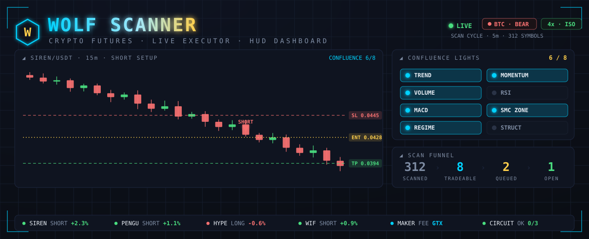
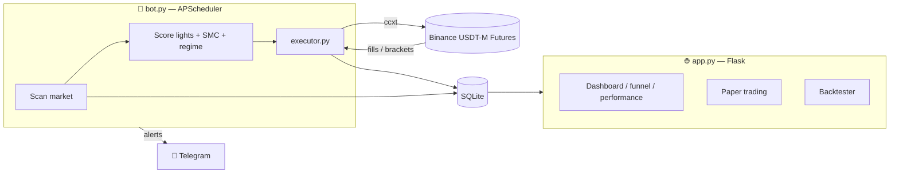

<div align="center">



# 🐺 Wolf Scanner

### An automated crypto futures scanner, live executor & web dashboard

*Scans the Binance USDT-M futures market for high-confluence setups, manages live trades with exchange-side brackets, and serves it all from a real-time dashboard.*

[](https://www.python.org/)
[](https://flask.palletsprojects.com/)
[](https://github.com/ccxt/ccxt)
[](https://apscheduler.readthedocs.io/)
[](#-testing)
[](LICENSE)

</div>

---

> ## ⚠️ Risk Disclaimer
> This software places **real orders with real money** on leveraged futures. Crypto futures can lose more than your margin. Nothing here is financial advice. Run in **dry-run** (`LIVE_TRADING=false`) until you fully understand the behaviour, and never trade size you can't afford to lose. **You are solely responsible for your own funds.**

---

## ✨ What it does

Wolf Scanner watches the whole Binance perpetuals market on a schedule, scores each coin on a stack of independent signals ("lights"), and only acts when enough of them line up *and* the market structure agrees. When a setup qualifies it can place a resting maker-limit entry with a full stop-loss / take-profit bracket sitting on the exchange — so fills and exits happen even if the bot is offline.

- 🔍 **Market-wide scanner** — ranks hundreds of USDT-M perps every cycle on volume, momentum, and structure.
- 🚦 **Confluence "lights" engine** — a trade needs multiple independent signals to agree before it's tradeable.
- 🧠 **Smart Money Concepts (SMC) gating** — never longs into resistance or shorts into support (with a configurable bear-trend override).
- 🐻 **BTC regime filter** — "don't fight Bitcoin": only longs in a bull, only shorts in a bear, both in chop.
- 🎯 **Exchange-side brackets** — resting LIMIT entry + SL + TP placed together (post-only maker fills, optional partial TP).
- 🛡️ **Risk guards** — fixed/max margin caps, max concurrent positions, daily circuit breaker, isolated leverage.
- 📊 **Live web dashboard** — scan funnel, market regime, both accounts, performance, stocks watch, liquidations, health.
- 🥇 **Second live engine (S3)** — Vegas flag-flip on XAUT (gold), signals *and* orders on Bybit.
- 📱 **Telegram topics group** — 📊 signals with Entry/SL/TP plans, 🔔 price alerts, 🌍 event radar, 💻 tech digest, 📈 daily report, 🇹🇼 台股 daily scan, 💥 BTC/ETH liquidation-cascade alerts, plus a command bot (`/winrate /positions /tw /liq …`).

---

## 🏗️ Architecture

Two cooperating processes share the same code and a SQLite database:



`./run_all.sh bg` launches **four processes**:

| Process | File | Role |
|---|---|---|
| **S1 bot** | `app/bot.py` | Cron loop: scan → qualify → place/manage live Binance orders |
| **S2 scanner** | `app/strategy2_scanner.py` | 15m TV.pine-confluence sweep + all Telegram topic services (event radar, tech digest, daily report, price alerts, 台股 scan, liquidation alerts, command bot) |
| **S3 scanner** | `app/strategy3_scanner.py` | Vegas flag-flip signals from Bybit candles → Bybit orders (XAUT) |
| **Web dashboard** | `app/app.py` | Flask UI + auth |
| Order layers | `app/executor.py` (Binance), `app/strategy3_exec.py` (Bybit) | ccxt calls, brackets, SL/TP, position tracking |
| Signals | `app/indicators.py`, `app/smc.py`, `app/market_intel.py` | Indicators, Smart Money Concepts, market regime |
| Telegram | `app/telegram_utils.py`, `app/tg_commands.py`, `app/event_radar.py`, `app/tech_news.py`, `app/daily_report.py`, `app/price_alerts.py`, `app/tw_stocks.py`, `app/liq_alerts.py` | Topics-group routing, command bot, and every topic's content |
| Config | `app/config.py` | All thresholds & flags (loaded from `app/.env` at startup) |

---

## 🖥️ Dashboard

The Flask app (default `http://127.0.0.1:4000`) serves a mobile-friendly PWA with:

| Page | What it shows |
|---|---|
| **Dashboard** | Live scan results, both account strips, price alerts, position-size calculator, 🚀 pump radar |
| **Funnel** | Why each coin passed or was rejected, gate by gate + best-trade hero |
| **Strategy 2** | TV.pine confluence meter, EMA chart (Lightweight Charts), score heatmap |
| **Market** | Market regime, breadth, liquidations, news sentiment, recent big events |
| **Performance** | Trade history, win rate, P&L (tabbed, real exchange records) |
| **Bybit** | The S3 sub-account: balance, positions, closed P&L |
| **Stocks** | TW50 + US100 watchlists with perp-vs-stock gap |
| **Health** | Process/freshness/log monitor for all four processes |
| **Account** | Admin: live balance, strategy selection, settings |

---

## 🚀 Quick start

```bash
# 1. Clone & enter
git clone https://github.com/Bill9417/crypto-trading-bot.git
cd crypto-trading-bot/app

# 2. Install deps (Python 3.12+)
pip install -r requirements.txt

# 3. Configure — copy the template and fill in your values
cp .env.example .env
#   → set FLASK_SECRET_KEY, Telegram token (optional)
#   → leave LIVE_TRADING=false to start in safe dry-run mode

# 4. Run the web dashboard
python app.py            # → http://127.0.0.1:4000

# 5. Run the scanner/bot (separate terminal)
python bot.py
```

> 💡 **Start safe.** Keep `LIVE_TRADING=false` and `USE_TESTNET=true` until you've watched the scanner and paper trades for a while. Flip to live only when you trust the behaviour.

To run the whole stack (web + S1 bot + S2/S3 scanners) detached in the background: `./run_all.sh bg` — and `./run_all.sh` alone shows status/stop options.

---

## ⚙️ Configuration

Everything is driven by `app/.env` (see `app/.env.example`). Key settings:

| Variable | Default | Meaning |
|---|---|---|
| `LIVE_TRADING` | `false` | `true` = place **real** orders. Start `false`. |
| `USE_TESTNET` | `true` | Use Binance testnet instead of mainnet |
| `LIVE_STRATEGY` | `default` | Strategy the live bot trades (`default`=S1 confluence) |
| `LEVERAGE` | `4` | Isolated leverage |
| `FIXED_MARGIN_USDT` | `50` | Margin committed per trade (notional = margin × leverage) |
| `MAX_CONCURRENT_POSITIONS` | `10` | Cap on simultaneous open + resting positions |
| `USE_RESTING_ORDERS` | `true` | Book LIMIT entry + bracket the moment a setup queues |
| `USE_POST_ONLY_ENTRY` | `true` | Maker-only (GTX) entry for the lower fee |
| `PLACE_BRACKET_ORDERS` | `true` | Attach exchange-side SL/TP to every entry |

> 🔒 **Secrets never leave your machine.** `.env`, databases, logs and cache files are all in `.gitignore`. Only `.env.example` (with placeholders) is committed.

---

## 🧠 How a trade is chosen

A coin must clear **every** gate to become tradeable:

1. **Liquidity** — enough 24h volume to fill cleanly.
2. **Lights / confluence** — multiple independent signals must agree; a minimum conviction bar (separate bars for longs vs shorts).
3. **BTC regime** — *don't fight Bitcoin*: bull → longs only, bear → shorts only, chop → both.
4. **SMC structure** — no longs into premium/resistance, no shorts into discount/support (bear-trend shorts can override the discount block).
5. **Risk caps** — respects max concurrent positions, margin caps and the daily circuit breaker.

Only then does the executor place a resting maker-limit entry with its SL/TP bracket.

---

## 🧪 Testing

```bash
cd app
pytest                      # full suite
./run_tests.sh              # convenience wrapper
```

Covers cost modelling, executor gates, regime detection, live-strategy selection, simulators and the paper engine.

---

## 📁 Project structure

```
crypto/
├── app/                        # ALL Python — flat by design (live imports)
│   ├── app.py                  #   Flask web dashboard + auth
│   ├── bot.py                  #   S1: APScheduler scan/execute loop (Binance)
│   ├── strategy2_scanner.py    #   S2: confluence sweep + Telegram topic services
│   ├── strategy3_scanner.py    #   S3: Vegas flag-flip loop (Bybit)
│   ├── executor.py             #   Binance order layer (brackets, SL/TP)
│   ├── strategy3_exec.py       #   Bybit order layer
│   ├── strategy3_signal.py     #   flag-flip rules (port of the XAUT pine)
│   ├── config.py               #   all thresholds & flags (from app/.env)
│   ├── indicators.py / smc.py / market_intel.py    # signal stack
│   ├── strategy2_meter.py      #   TV.pine confluence meter (/strategy2)
│   ├── telegram_utils.py       #   topics-group routing (one bot, 8 topics)
│   ├── tg_commands.py          #   /winrate /positions /signals /tw /liq …
│   ├── event_radar.py / tech_news.py / daily_report.py
│   ├── price_alerts.py / tw_stocks.py / liq_alerts.py / liquidations.py
│   ├── stocks_data.py          #   TW50 + US100 watchlist fetchers
│   ├── templates/ + static/    #   dashboard pages, CSS, PWA assets
│   └── tests/                  #   pytest suite (240 tests)
├── pine/
│   ├── strategies/             # backtestable strategy() scripts (live + research)
│   └── indicators/             # chart indicator() scripts (incl. TV.pine)
├── docs/                       # USAGE.md, PROJECT_MEMORY.md (historical)
├── run_all.sh                  # start/stop the whole stack (./run_all.sh bg)
├── run_web.sh / run_bot.sh / run_strategy2.sh / dev.sh
├── tunnel.sh                   # Cloudflare quick-tunnel for the dashboard
├── sync.sh                     # commit+push helper
└── README.md
```

---

## 🛠️ Tech stack

**Python** · **Flask** + Flask-Login + Flask-SQLAlchemy · **APScheduler** · **ccxt** (Binance USDT-M) · **pandas** / **numpy** / **ta** · **SQLite** · **Telegram Bot API**

---

## 📜 License

Released under the [MIT License](LICENSE).

<div align="center">

*Built for research and education. Trade responsibly. 🐺*

</div>
